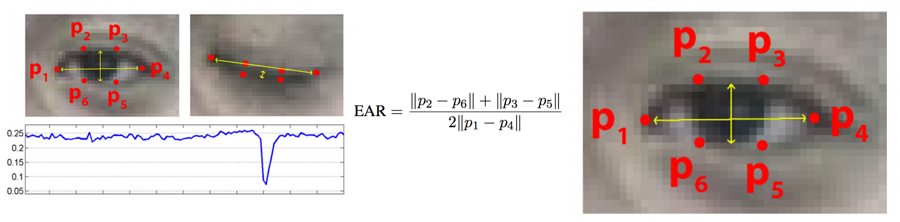

  

       
  

  <b><h3> Driver sleep detection and alerting system </h3></b>
  
 Driver sleep detection and alerting system with python and opencv

 
 

## How this works

It takes video as an input and it will detect eyes of the driver and if the driver closes eyes it will send an alert and start playing sound.

  

**_image source: youtube_**

## Libraries used

- opencv-python
- numpy
- dlib
- face-utils
- imutils
- pushbullet.py
- scipy
- pygame
